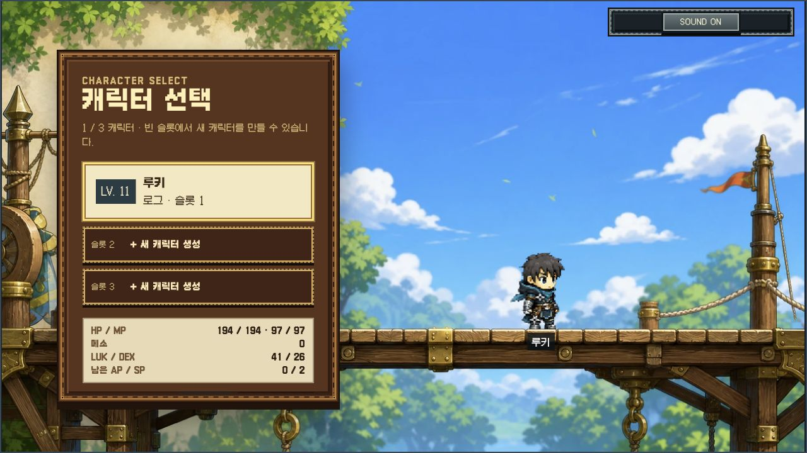
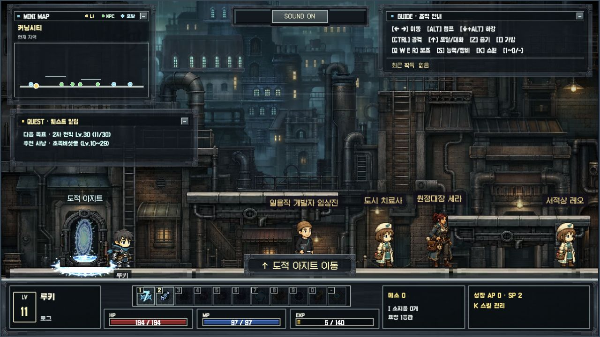
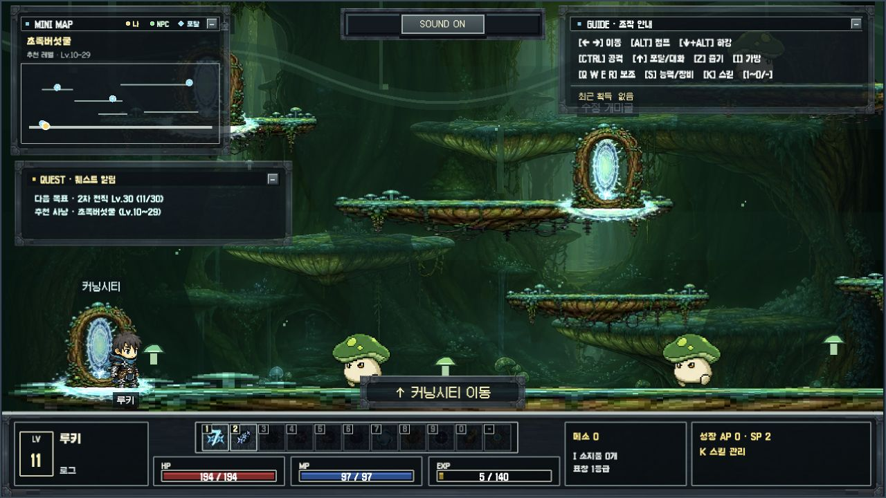
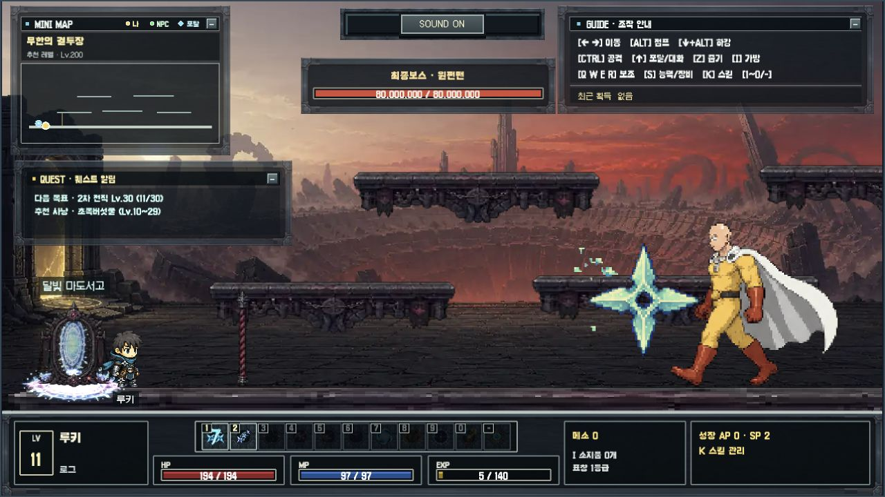
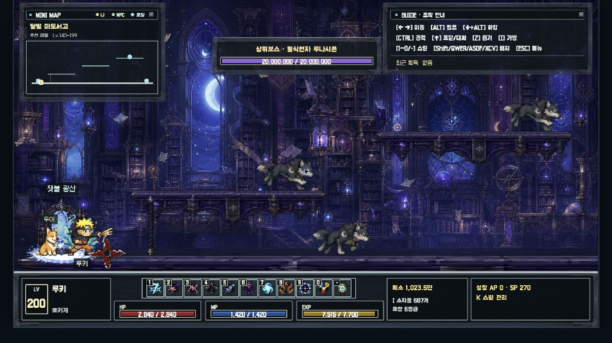

# Kerning Shadows

`Kerning Shadows`는 브라우저에서 바로 실행하는 로컬 싱글 플레이 횡스크롤 액션 RPG 데모다.
TypeScript, Vite와 Phaser 3로 제작했으며 이동·점프·표창 전투, 4단계 전직, Lv.200 성장,
11개 맵, 보스 원정, 비전투 점프 맵과 자동 회수 펫 두아를 하나의 오프라인 플레이 흐름으로 제공한다.

핵심 구현 P0~P72는 2026년 7월 16~18일, 모바일·전송 최적화 P73~P79는 2026년 7월 29일,
모바일 생성 입력 보정 P80은 2026년 7월 30일에 완료했다. 현재 제품·재현 기준은 P80이다.

## 스크린샷

| 캐릭터 선택                                                              | 마을 · 커닝시티                                                            |
| ------------------------------------------------------------------------ | -------------------------------------------------------------------------- |
|           |               |
| 사냥터 1 · 초록버섯굴                                                    | 최종 보스 · 원펀맨                                                         |
|  |  |
| 사냥터 2 · 달빛 마도서고                                                |                                                                            |
|  | |

## 주요 특징

- PC와 모바일 웹 브라우저에서 실행하는 1280×720 논리 해상도 픽셀 아트 게임
- 로그인 → Lv.9 일반 또는 Lv.120 호카게 부스트 생성 → 최대 3개 캐릭터 슬롯 → 게임 플레이 화면 흐름
- iOS Chrome을 포함한 터치 브라우저에서 빈 슬롯을 누르면 바로 열리는 닉네임 입력과 완성형·한글 자모 지원
- 슬롯마다 성장, 장비, 인벤토리, 스킬, 퀘스트와 맵 위치를 독립적으로 저장하는 로컬 프로필
- 점프·공중 공격 중에도 반대 키를 누르는 즉시 좌우 방향을 바꿀 수 있는 공중 조작
- 지면·단방향 발판·줄, `↓+Alt` 발판 하강, 포탈과 데이터 기반 11개 맵
- 초보자 → 로그 → 어쌔신 → 허밋 → 호카게 전직 시험, 1차부터 입장하는 그림자 시험장
- 액티브 스킬 11종, 패시브 스킬 4종, AP·SP 분배와 숫자·Shift/QWER/ASDF/XCV를 자유롭게 편집하는 스킬 슬롯
- 버섯·늑대·좀비·식물형 일반 몬스터, 중간·상위·최종 보스, 원펀맨 넉백 면역·체력 50% 2페이즈, 드롭·회수·소모품 사용·상점·표창 장비
- 원펀맨 클리어 뒤 개발 분야와 게임 레퍼런스를 보여 주고 자동 종료·버튼·`ESC` 뒤 플레이를 계속하는 픽셀 아트 게임 크레딧
- 1,000,000 메소에 최대 1개를 보유하고 사망 시 같은 자리에서 한 번 즉시 되살리는 부활의 부적
- 커닝시티의 두아에게 50,000 메소 `멍푸치노`를 주면 등록되어 자연스러운 교차 접지 달리기로 높은 발판까지 따라다니며 드롭을 자동 회수하는 펫
- 최대 MP 1%의 초당 유지비와 2배속 무기 강화 할퀴기·이동속도 +20%를 제공하는 구미호 변신
- 크리티컬 전용 데미지 숫자와 시네마틱 중에도 수명이 보존되는 다중 투사체 전투 연출
- 축소 지형·플레이어·NPC·포탈을 표시하는 미니맵과 독립적으로 접을 수 있는 HUD 창
- 폭열군주 이그니카르 처치 직후 커닝시티에 생성되는 달빛 서고 포탈
- 키보드와 스크린 리더를 고려한 DOM 팝업, 자체 스크롤과 800×600 PC 창 대응
- 가로·세로 터치 화면의 전체 창 레이아웃, 위아래 여백을 활용하는 세로 모바일 시트, 좌우·아래 조이스틱과 고정 점프·별도 대화/이동·공격·줍기·직업별 대표 스킬 4슬롯
- `ESC` 전체 메뉴에서 여는 인벤토리·스탯/장비·스킬·스킬 단축키·환경설정
- 핵심 스프라이트 24종과 스킬 아이콘 15종을 원본 픽셀과 동일한 무손실 WebP로 전송
- 일반 BGM은 첫 화면에서 바로 준비하고 보스 BGM은 살아 있는 보스를 처음 만날 때 한 번만
  지연 로딩하는 전환, SFX 12종과 전체 음소거·BGM/SFX 개별 볼륨 저장

## 지원 환경

- Windows: 최신 Chrome, Edge, Firefox
- macOS: 최신 Chrome, Firefox, Safari
- 모바일·태블릿: 최신 터치 브라우저, 가로 플레이와 세로 전체 화면 UI 지원
- 기준 게임 해상도: 1280×720
- 최소 검증 창: 800×600에서 800×450 게임 영역과 레터박스
- 키보드 또는 화면 터치 조작, 별도 플러그인 불필요

게임패드, 네이티브 앱, 멀티플레이와 계정 서버는 지원하지 않는다.

## 빠른 실행

Node.js `^20.19.0` 또는 `>=22.12.0`이 필요하다.

```bash
npm ci
npm run dev
```

개발 서버는 기본적으로 `http://127.0.0.1:4173/`에서 실행된다.

프로덕션 산출물을 로컬에서 확인하려면 다음 명령을 사용한다. `dist/index.html`을 `file://`로
직접 열지 않는다.

```bash
npm run build
npm run preview
```

preview 서버는 기본적으로 `http://127.0.0.1:4174/`를 사용한다.

핵심 스프라이트와 스킬 아이콘의 원본 PNG를 수정했다면 무손실 런타임 WebP를 다시 생성한다.

```bash
npm run assets:webp
```

## 조작

| 키                             | 동작                                           |
| ------------------------------ | ---------------------------------------------- |
| `←` / `→`                      | 좌우 이동, 줄에서 이탈                         |
| `↑`                            | 포탈·NPC 상호작용, 줄 올라가기                 |
| `↓`                            | 줄 내려가기                                    |
| `Alt`                          | 점프, 줄에서 이탈                              |
| `↓+Alt`                        | 현재 단방향 발판 아래로 하강                   |
| `Ctrl`                         | 기본 표창 공격, 변신 중 2배속 무기 강화 할퀴기 |
| `1~0`, `-`                     | 현재 순서의 액티브 스킬 11종                   |
| `Shift`, `QWER`, `ASDF`, `XCV` | 자유 배치 가능한 추가 스킬 키                  |
| `B/N`                          | 구미호 변신/삼인 협공 고정 보조키              |
| `Z`                            | 가까운 아이템·메소 회수(고정)                  |
| `I`                            | 24칸 인벤토리·소모품 사용                      |
| `S`                            | 추가 스킬이 없을 때 능력치·표창 장비 창        |
| `K`                            | 스킬·SP 분배 창                                |
| `ESC`                          | 전체 메뉴 열기·현재 팝업 닫기                  |

게임 단축키의 브라우저 기본 동작은 Canvas에 포커스가 있을 때만 차단한다. DOM 팝업을 닫으면
Canvas 포커스가 자동으로 복구된다. `ESC` 전체 메뉴의 `스킬 단축키`에서는 `1~0/-` 숫자/HUD
슬롯과 `Shift`, `QWER`, `ASDF`, `XCV` 추가 키를 선택해 액티브 스킬을 배치할 수 있다. 같은
영역 안에서는 드래그 앤 드롭이나 `Alt+←/→`로 교환하며 추가 키는 비울 수도 있다. 기본 배치는
기존 Shift/QWER/XCV 공격을 보존하고 A/D/F/S는 비어 있다. S는 비어 있을 때 스탯/장비 창을
열며, Z는 스킬을 배치할 수 없는 고정 아이템 회수 키다. 우측 상단 조작 안내에서도 `Z 줍기`를
항상 확인할 수 있다. 변경은 현재 캐릭터 슬롯에 즉시 저장되고 HUD와 실제 입력에 함께 반영된다.
점프 중에는 `←` 또는 `→`를 누르는 즉시 해당 방향의 공중 최고속도로 전환되며, 방향 키를
놓으면 현재 수평 관성을 유지한다. 기본 공격이나 스킬 동작 중에도 같은 공중 조작을 사용할 수
있다. 사운드 설정은 게임 상단이 아닌 `ESC` → `환경설정`에서 조정한다.

터치 장치에서는 좌측 하단 조이스틱의 좌우 입력으로 이동한다. 조이스틱을 아래로 누른 채 고정
`점프` 버튼을 누르면 현재 단방향 발판 아래로 하강한다. 우측 하단에는 점프를 항상 유지하고,
NPC 근처의 `대화`와 포탈·줄 근처의 `이동` 버튼을 별도로 표시한다. 상황에 맞는 `대화/이동`은
항상 `줍기` 왼쪽에 배치해 `대화/이동 → 줍기 → 점프 → 공격` 순서를 유지한다. 같은 영역에는
현재 직업 차수의 대표 액티브 스킬을 최대 4개만 표시한다. 로그는 럭키세븐·그림자 연사,
어쌔신은 드레인·환영 쌍성, 허밋은 어벤저·심연 폭우, 호카게는
나선환·미수옥·삼인 협공·천뢰옥으로 네 슬롯을 모두 사용한다. `MENU` → `스킬 단축키`도 현재 차수
주 스킬을 최대 4개만 표시하며, 네 슬롯의 순서를 터치로 바꾸면 모바일 HUD와 실제 입력에 즉시
반영된다. 우측 상단 `MENU`는 데스크톱의 `ESC`
전체 메뉴와 같다. 팝업이나 호카게 시네마틱이 열리면 터치 컨트롤은 자동으로 숨고, 닫으면 현재
직업 구성으로 복구된다.

Lv.10에 다크로드에게 1차 전직 시험을 받으면 도적 아지트의 그림자 시험장 포탈이 열리고, 시험장
안의 초록버섯 5마리를 처치해 로그 전직을 완료한다. 던전 원정에서는 폭열군주 이그니카르의
사망·보상 확정과 함께 커닝시티의 달빛 서고 포탈이 생성되며 미니맵 마커와 포탈 효과도 같은
시점부터 나타난다.

세로 화면에서는 16:9 게임 Canvas 위아래의 남는 공간까지 로그인·캐릭터 선택/생성·전체 메뉴와
모든 팝업이 사용한다. 긴 인벤토리·스킬·단축키·상점은 가로로 밀리지 않고 패널 안에서 세로로
스크롤되며, 제목과 닫기·취소·확정 버튼은 계속 접근할 수 있다. 입력 글자는 모바일 브라우저의
자동 확대를 막는 16px 이상, 버튼과 링크는 최소 44px 터치 영역으로 표시하고 기기 safe-area를
피한다. 플레이 HUD의 미니맵·퀘스트·조작 안내 최소화 버튼은 세로 화면에서 28px로 작게
표시해 미사용 영역을 가리지 않는다.

페이지를 처음 불러오면 `이 게임은 PC 환경에 최적화되어 있습니다.`와
`BGM과 함께 플레이하려면 매너모드를 해제해주세요` 안내가 게임 화면 위에 두 줄로 먼저
나타나며 3초 뒤 자동으로 사라진다.

## 플레이 흐름

새 계정에는 기본 캐릭터가 없다. 로그인 뒤 닉네임과 주사위 능력치를 정하면 기본적으로 Lv.9
초보자로 시작한다. 생성 화면에서 `Lv.120 호카게 부스트`를 선택하면 같은 슬롯에 자동 분배 능력치,
모든 스킬 Lv.20, 완전 회복 상태의 Lv.120 호카게를 바로 만들 수 있다. 생성 가능한 슬롯은 최대
3개이며 부스트 여부는 다른 슬롯에 영향을 주지 않는다.

입문 루프는 다음과 같다.

```text
로그인 → Lv.9 첫 캐릭터 생성 → Lv.10 성장 → 1차 전직 시험 수락
→ 초록버섯 5체 처치 → 완료 보고 → 로그 전직 → 드롭 회수 → 커닝시티 귀환
```

장기 플레이에서는 Lv.30·60·120 전직을 거쳐 15개 스킬을 해금하고, Lv.100부터 보스 원정을
진행한다. 원정은 이그니카르 → 루나시온 → Lv.200 최종보스 순서이며 단계를 건너뛸 수 없다.
일반 사냥 경로도 수정굴 늑대 → 망각된 기술자 좀비 → 산호 맹그로브 → 잿불 광부 좀비 →
월광 늑대로 이어져, 던전마다 동물·언데드·식물 실루엣과 이동 속도가 뚜렷하게 달라진다.
초록버섯굴에서는 인내의 숲으로 이동해 20개 단방향 발판, 줄 4개와 움직이는 장애물 10개를
통과하고 최초 1회 정상 보상을 받을 수 있다.

최종보스 원펀맨은 플레이어 공격에 밀리거나 피격 경직으로 주먹 동작이 끊기지 않는다. 1페이즈는
주먹을 뻗어 청백색 단일 충격파를 발사하고, 체력이 50% 이하가 되는 즉시 2페이즈로 전환해
금백색 진심 펀치 삼중 충격파를 부채꼴로 발사한다. 두 패턴은 표창 스프라이트를 사용하지 않는다.
무한의 결투장 2층·상층 발판에서도 투사체의 수평 경로나 구미호 변신 `Ctrl` 할퀴기의 전방
사거리가 원펀맨에 닿으면 정상적으로 피해를 준다.
원펀맨의 사망 애니메이션과 보상·원정 진척 저장이 끝나면 18초 픽셀 아트 크레딧이 열린다.
시스템, 던전 디자인, 몬스터 디자인, 캐릭터 디자인, 스킬 디자인, FX와 테스트는 모두
`임상진 with Codex`, 게임 레퍼런스는 `메이플스토리`로 표시한다. 크레딧은 자동으로 끝나며
`크레딧 닫고 계속 플레이` 또는 `ESC`로 바로 닫을 수도 있고, 이후 현재 게임 플레이가 재개된다.

커닝시티 서적상 레오에게서 50,000 메소짜리 `멍푸치노`를 산 뒤 혼자 앉아 있는 두아에게 주면
현재 캐릭터 슬롯의 펫으로 등록된다. 두아는 맵 이동과 새로고침 뒤에도 따라오며, 사냥터에서
바닥에 착지한 가까운 아이템과 메소를 대신 회수한다. 등록 전 상태와 멍푸치노 보유량도 슬롯마다
독립적으로 저장된다. 두아의 이동속도는 변신 캐릭터보다 조금 빠르고, 캐릭터가 바로 위 발판으로
점프하거나 진행 방향이 막히면 함께 점프한다. 줄처럼 직접 따라갈 수 없는 큰 높이 차에서는 가까운
추적 지점으로 복귀한다. 달릴 때는 두 대각발의 접지와 다리 회수를 번갈아 보여 짧은 다리가 같은
자세로 튀거나 네 발이 모두 뜬 것처럼 보이지 않는다. 플레이어와 적정 간격에 도달한 뒤에도 이동
중에는 현재 속도를 맞춰 계속 달리고, 플레이어가 멈추면 부드럽게 감속한 뒤 대기 자세로 바뀐다.

크리티컬 공격은 일반·강한 공격과 구분된 밝은 숫자와 확대 연출로 표시된다. 호카게 시네마틱
중에는 이미 발사된 투사체의 수명이 흐르지 않으며, 레벨업 연출은 이동과 전투 입력을 막지 않는다.

구미호 변신은 활성화 뒤 매초 최대 MP의 1%를 소모하며 그동안 자연 MP 회복이 멈춘다. MP가
0이 되면 자동 해제된다. 변신 중 `Ctrl` 할퀴기는 공격 주기와 타격이 2배 빨라지고 LUK/DEX
무기 보정과 현재 장착 표창의 피해 배율을 함께 받아 일반 표창 공격보다 강하다. 수평 이동
최고속도와 보행 모션도 20% 빨라지며 수동 해제나 MP 고갈 때 즉시 원래 속도로 돌아온다.

`I` 인벤토리에서 회복 물약과 경험의 서를 선택해 `사용하기`를 누를 수 있다. 회복 물약은
HP·MP를 각각 최대치의 50% 회복하고, 경험의 서는 현재 EXP를 유지한 채 최대 10레벨 성장한다.
재료와 표창은 소비되지 않으며 사용 결과와 남은 수량은 현재 캐릭터 슬롯에 즉시 저장된다.

서적상 레오는 `부활의 부적`을 1,000,000 메소에 판매한다. 캐릭터 슬롯마다 최대 1개만 보유할 수
있고 직접 사용하는 버튼은 없다. HP가 0이 되는 순간 자동으로 1개를 소비해 현재 맵과 위치를
유지한 채 HP와 MP를 모두 회복한다. 소비 뒤 다시 사망하면 기존처럼 커닝시티에서 부활한다.

## 이 게임을 따라 만드는 방법

새 저장소에서 같은 범위의 게임을 만들려면 [`PROMPT.md`](./PROMPT.md)를 제품 명세의 단일
시작점으로 사용한다. 기존 개발 이력을 그대로 반복하지 않고 재현용 P0~P9 단계로 진행한다.

### 권장 순서

1. AI 코딩 에이전트에 `PROMPT.md` 전체를 프로젝트 컨텍스트로 제공한다.
2. `PROMPT.md` 1~4장에서 제품 목표, 지원 범위와 독자 에셋 원칙을 확인한다.
3. 5~13장의 화면·월드·전투·성장·UI·저장·에셋·오디오 명세를 제품 계약으로 사용한다.
4. 14장의 마스터 프롬프트로 빈 저장소의 에셋 감사표와 `ROADMAP.md`를 만든다.
5. 15장의 P0~P9 프롬프트를 한 단계씩 전달하고, 테스트와 커밋 뒤 다음 단계로 이동한다.
6. 16장 최종 인수 시나리오와 17장 릴리스 체크리스트로 결과를 검증한다.

### 문서 읽기 순서

| 문서                                     | 용도                                                         |
| ---------------------------------------- | ------------------------------------------------------------ |
| [`PROMPT.md`](./PROMPT.md)               | 전체 기능 명세, BGM 제작 가이드, 마스터·단계별 구현 프롬프트 |
| [`AGENTS.md`](./AGENTS.md)               | 이 저장소의 구현 원칙, 단일 기준 모듈과 커밋 규칙            |
| [`ASSET_GUIDE.md`](./ASSET_GUIDE.md)     | 스프라이트·맵·UI·오디오를 만들거나 교체하기 전 확인할 규격   |
| [`ROADMAP.md`](./ROADMAP.md)             | 구현 단계와 각 기능의 완료 조건·의사결정 기록                |
| [`ASSET_CREDITS.md`](./ASSET_CREDITS.md) | 에셋 제작·변환·라이선스·배포 조건                            |
| [`RELEASE_QA.md`](./RELEASE_QA.md)       | 자동화 결과, 지원 브라우저와 남은 수동 릴리스 게이트         |
| [`VISUAL_QA.md`](./VISUAL_QA.md)         | 1280×720 기준 화면·HUD·에셋 시각 회귀 체크리스트             |

문서가 충돌하면 `PROMPT.md`의 최종 제품 계약, 현재 소스의 순수 규칙·테스트, `AGENTS.md`,
과거 `ROADMAP.md`·QA 기록 순으로 판단한다.

저장소에는 외부 레퍼런스 이미지를 포함하지 않는다. 그래픽은 독자적으로 제작하거나 권리가 확인된
에셋만 사용한다. 새 BGM은 직접 작곡하거나 Suno에서 Instrumental 일반곡·보스곡을 만든 뒤 생성
당시 플랜·약관·프롬프트, 원본·출력 해시, 편집 내역과 실제 루프 구간을 기록한다. 자세한 절차는
`PROMPT.md` 12장과 [`assets/audio/README.md`](./assets/audio/README.md)를 따른다.

## 검증

일반 변경은 다음 세 명령을 통과해야 한다.

```bash
npm run typecheck
npm test
npm run build
```

첫 E2E 실행 전 Playwright 브라우저 엔진을 설치한다.

```bash
npx playwright install chromium firefox webkit
npm run release:check
```

`release:check`는 단위 테스트, 타입 검사·프로덕션 빌드, Chromium·Firefox·WebKit E2E와
`dist/` 감사를 실행한다. 릴리스 산출물은 고지와 크레딧을 포함하며, BGM 제외 총량 8MB,
JavaScript 1.5MB, JavaScript gzip 450KB 상한을 지켜야 한다.

P80 기준으로 46파일·360개 단위 테스트, 3엔진 모바일 E2E 9/9, 타입체크·Terser 빌드가
통과했다. 최종 `dist/`는 86파일·9,783,295 bytes이고 BGM 2,916,872 bytes를 제외한 감사
적용값은 6,866,423 bytes다.

자동화 범위와 남은 실제 브라우저·장시간 성능 검증은 [`RELEASE_QA.md`](./RELEASE_QA.md)에 기록한다.

## 프로젝트 구조

```text
src/game/
  scenes/        Boot, 로그인, 캐릭터 생성·선택, Gameplay
  input/         물리 키와 게임 액션 분리, 포커스 안전 처리
  data/          플레이어·몬스터·NPC·아이템 카탈로그
  maps/          맵·발판·줄·포탈·스폰·장애물 데이터
  entities/      플레이어·몬스터와 스프라이트 배치
  combat/        공격·피격·방어·보스 원거리 규칙
  progression/   EXP·레벨·회복·AP 규칙
  skills/        액티브·패시브·SP·슬롯 규칙
  equipment/     표창 구매·소유·장착·피해 배율
  pets/          두아 등록·추적·자동 회수 순수 규칙
  loot/          드롭·회수·표현 규칙
  quests/        전직·보스 원정·인내의 숲 보상
  profile/       캐릭터 생성 검증·3슬롯 저장·마이그레이션
  settings/      캐릭터와 분리된 오디오 설정
  effects/       포탈·전직·레벨업·공격·시네마틱 연출
  ending/        원펀맨 클리어 크레딧 문구·길이·표시 조건
  audio/         일반/보스 BGM과 SFX 수명주기
  ui/            HUD·미니맵·DOM 오버레이·접근성
assets/
  sprites/       런타임 4×4 시트, 생성 원본, 매니페스트
  maps/          배경·레이어·환경 오브젝트
  ui/            화면·패널·폰트·스킬 아이콘·시네마틱
  audio/         BGM, 절차 생성 SFX와 권리 문서
tests/e2e/       프로덕션 preview 대상 통합 테스트
scripts/         에셋 생성·정리와 dist 감사
```

## 저장과 알려진 제한

- 프로필은 브라우저 origin별 `localStorage`에만 저장되며 다른 브라우저·포트와 공유되지 않는다.
- 서버 인증이나 클라우드 동기화가 없다. 로그인 입력은 로컬 화면 흐름을 위한 값이다.
- 브라우저 자동 재생 정책 때문에 첫 사용자 입력 전에는 BGM·SFX가 잠길 수 있다.
- 일반 사냥 성장 속도는 데모 규모에 맞춘 값이며 장기 서비스용 경제 밸런스가 아니다.
- 자동화 브라우저 통과는 실제 키보드 고스팅, 스피커 출력과 30분 성능 검증을 대체하지 않는다.

## 에셋과 고지

런타임은 Vite URL import로 필요한 에셋만 번들링한다. 생성 원본과 제작 프롬프트는 개발 기록으로
보존하되 `dist/`에는 포함하지 않는다. 외부 레퍼런스 이미지는 저장소와 배포 산출물에 보관하지 않는다.

파일별 제작·변환·배포 조건은 [`ASSET_CREDITS.md`](./ASSET_CREDITS.md)를 따른다. 프로덕션
산출물에는 Phaser MIT, Galmuri OFL과 제3자 고지가 포함된다.
