# Map Background Assets

PC 웹 1280×720 플레이 화면에 사용하는 자체 제작 환경 배경이다.

출처·생성 과정과 배포 조건은 [`ASSET_CREDITS.md`](../../ASSET_CREDITS.md)를 따른다.

## 구조

- `source/`: built-in `imagegen` 생성 원본 PNG
- `screens/`: 1280×720으로 중앙 크롭·정규화한 런타임 WebP
- `objects/`: 11개 맵의 imagegen 발판·줄·포탈 아틀라스와 인내의 숲 장애물 투명 WebP
- `layers/`: 런타임 패럴랙스 3종과 충돌 좌표 검증용 1920×720/1920×1440 SVG

## 런타임 파일

- `screens/kerning-city-v1.webp`: 산업적인 야간 도시 외부
- `screens/shadow-hideout-v1.webp`: 커닝시티에 속한 도적 아지트 내부
- `screens/mushroom-cave-v1.webp`: 수직 발판이 있는 초록버섯 동굴
- `screens/shadow-trial-v1.webp`: 청흑 석실·룬 문·사슬이 있는 전직 시험 던전
- `screens/crystal-ant-nest-v1.webp`: 호박빛 벌집 방과 청록 수정이 있는 뿌리 동굴
- `screens/clockwork-tower-v1.webp`: 황동 톱니·태엽·장난감 구조물의 야간 탑 내부
- `screens/sunken-coral-temple-v1.webp`: 수중 석조 아치·산호·빛줄기가 있는 침수 신전
- `screens/ember-mine-v1.webp`: 용암·흑철 광차·청색 광석이 있는 화산 광산
- `screens/moonlit-arcane-library-v1.webp`: 달빛 창·거대 서가·마력지가 있는 지하 서고
- `screens/infinite-duel-ground-v1.webp`: 충격 분화구·붉은 여명·다층 회피 발판이 있는 최종보스 전용 맵 원경
- `screens/patience-forest-v1.webp`: 거목·폭포·청록 안개와 호박색 반딧불이 있는 비전투 점프 맵 원경
- `layers/kerning-city-midground-v1.svg`: `scrollFactor 0.55` 건물·배관 중경
- `layers/kerning-city-foreground-v1.svg`: 충돌 발판과 정렬된 벽돌·배관·간판 전경
- `layers/mushroom-cave-midground-v1.svg`: `scrollFactor 0.38` 수직 암벽·뿌리·발광 버섯 중경
- `layers/mushroom-cave-foreground-v1.svg`: 충돌 발판·포탈과 정렬된 발광 버섯 전경
- `layers/shadow-trial-midground-v1.svg`: `scrollFactor 0.42` 룬·사슬·안개 중경
- `layers/shadow-trial-foreground-v1.svg`: 지면 `610`과 정렬된 석재·보라 광원 전경
- `objects/map-object-kits-a|b-v1.webp`, `objects/map-object-kits-c-v2.webp`: 11개 맵별
  발판·줄·포탈과 P49 포탈 바닥 광륜을 배경 팔레트로 구분한 512×512 imagegen 투명 아틀라스
- `objects/patience-hazards-v1.webp`: 인내의 숲 통나무·도토리·가시 구체를 담은 384×384 imagegen 투명 아틀라스
- `layers/*-foreground-v1.svg` 던전 6종: 회랑 5개 맵의 충돌 발판·양방향 포탈·첫 발판을
  잇는 줄 1개와, 줄이 없는 무한의 결투장 연속 지면·2단 단방향 발판 5개·귀환 포탈을
  `data-platform-*`·`data-portal-*`·`data-climbable-*`로 정렬한 결정적 전경
- `layers/patience-forest-foreground-v1.svg`: 연속 지면·단방향 나뭇가지 발판 20개, 줄 4개, 장애물 10개와 입구·정상 포탈을 `data-*` 좌표로 정렬한 1920×1440 검증 전경

배경 이미지는 시각 표현만 담당한다. 실제 월드 크기, 레이어 깊이·스크롤 비율,
충돌 발판, 스폰, 포탈, NPC 좌표는 `src/game/maps/map-definitions.ts`에서 관리한다.
커닝시티·초록버섯굴, 던전 회랑 6종과 인내의 숲 SVG는 `scripts/generate-map-layers.mjs`로 결정적으로 재생성하되, 실제 환경 오브젝트는 `objects/`의 imagegen 프레임을 사용한다.

## 미리보기

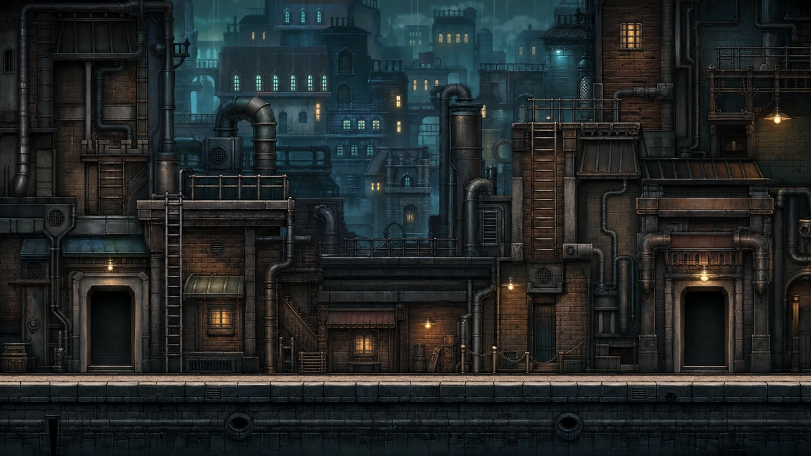

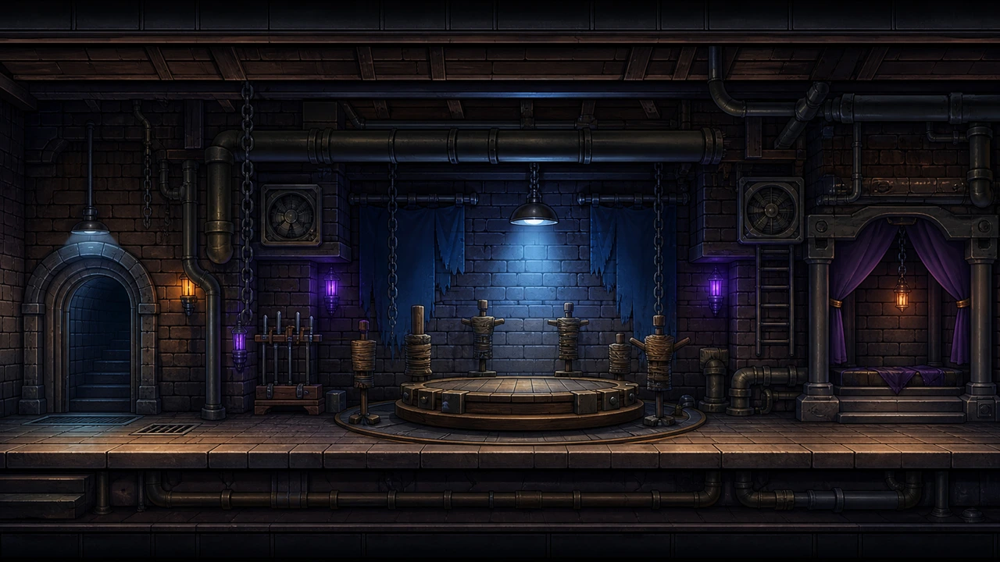

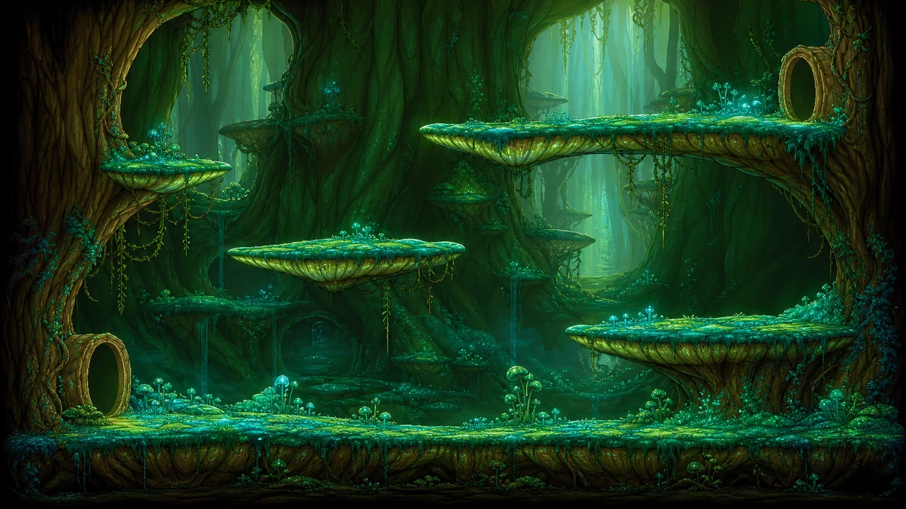

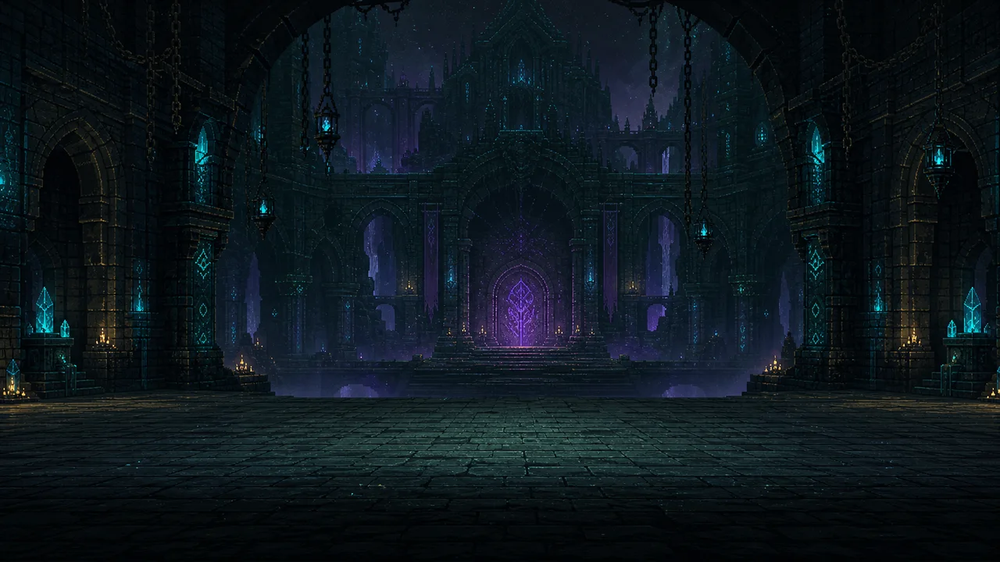

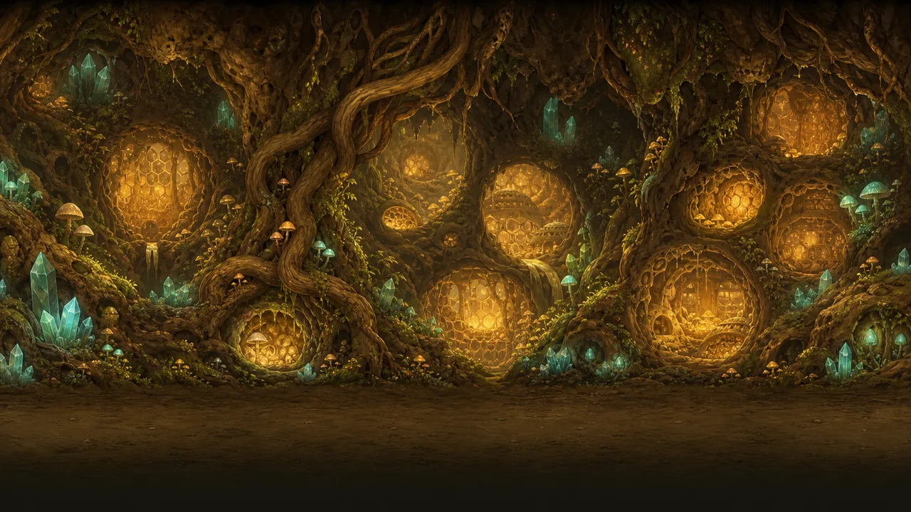

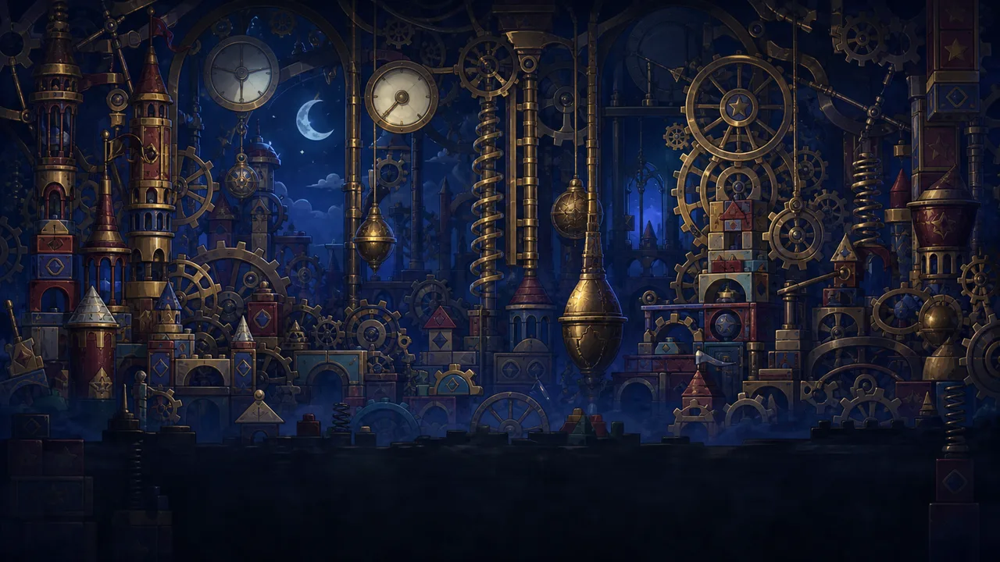

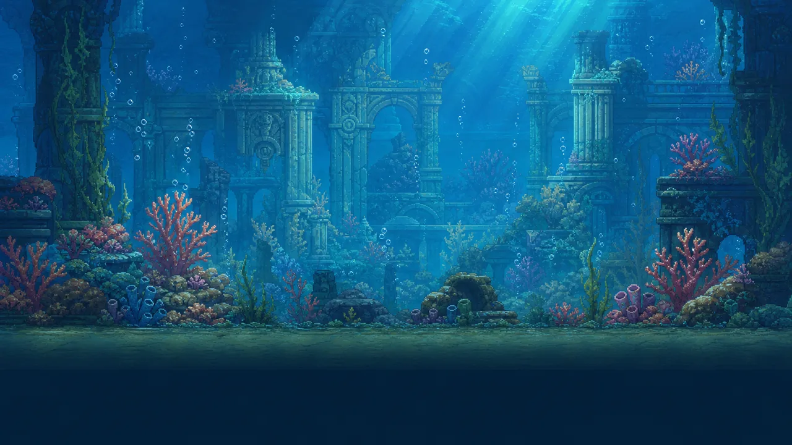

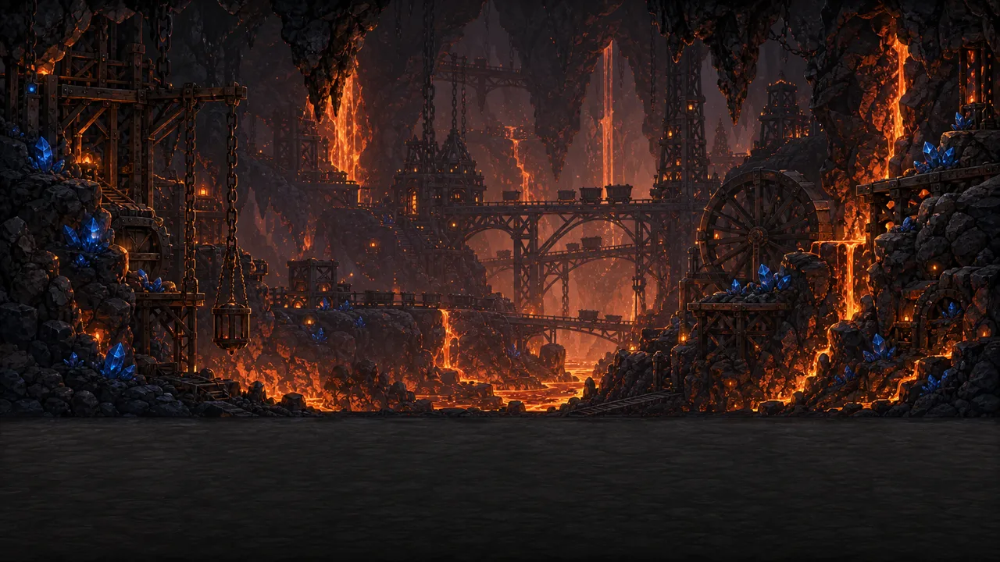

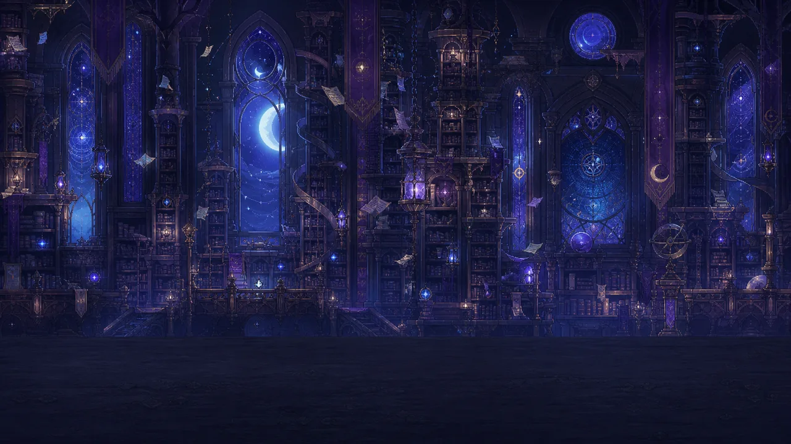

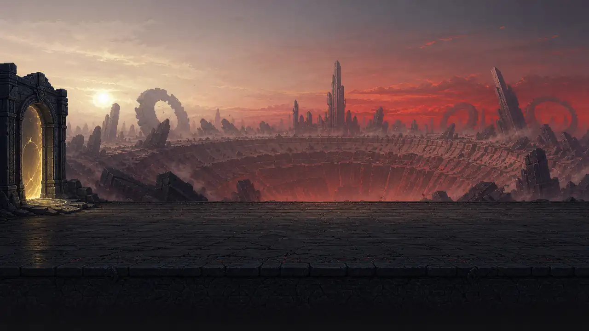

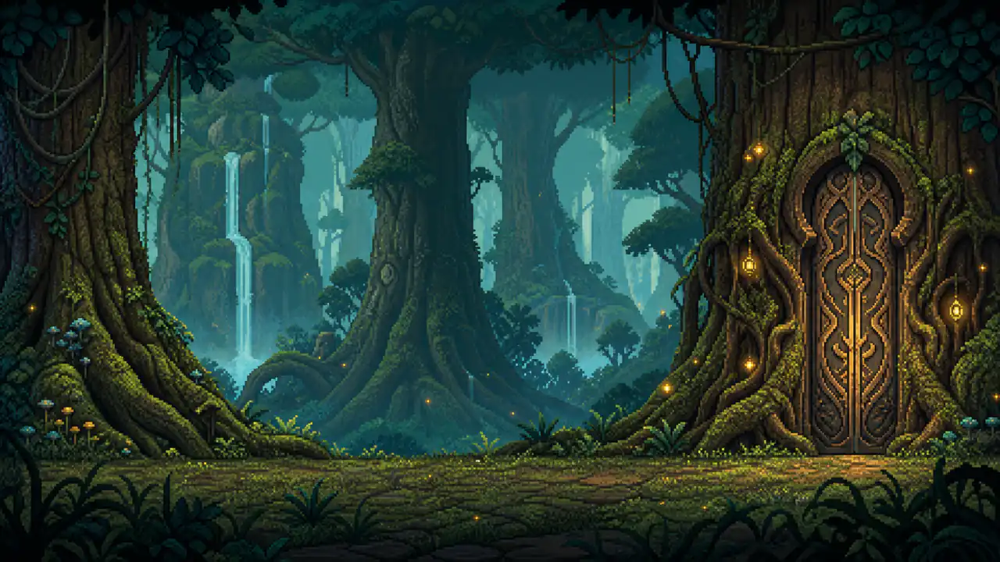
