# Core Sprite Sheets

웹 게임 데모용 핵심 스프라이트 시트다. 정규화 원본 PNG와 런타임 lossless WebP는 모두
512×512 RGBA 픽셀이며 128×128 셀을 4×4로 배치한다.

출처·생성 과정과 배포 조건은 [`ASSET_CREDITS.md`](../../ASSET_CREDITS.md)를 따른다.

## 디렉터리

- `core/`: 보존용 정규화 PNG와 게임에 직접 연결할 무손실 WebP
- `source/`: built-in imagegen에서 생성된 크로마 배경 원본
- `sprite-manifest.json`: 프레임 인덱스, 재생 속도, 반복, 원점
- `PROMPTS.md`: 최종 생성 프롬프트 세트와 현재 프로젝트 입력 역할

## 시트 미리보기

### Player

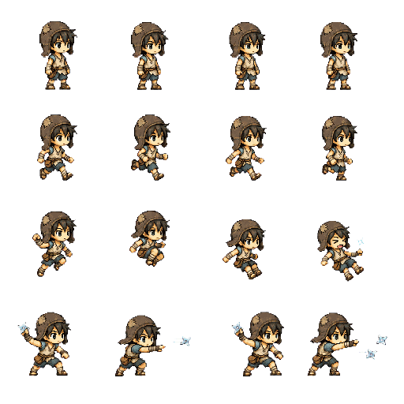

### Job Advancement Players

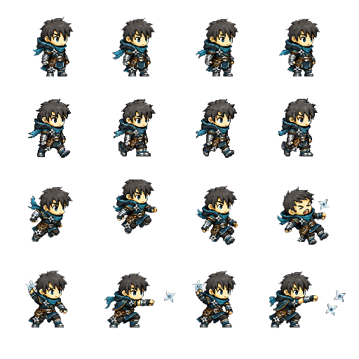

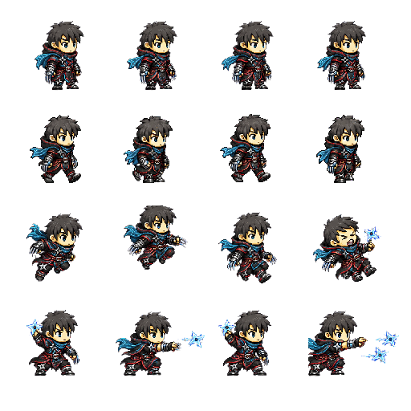

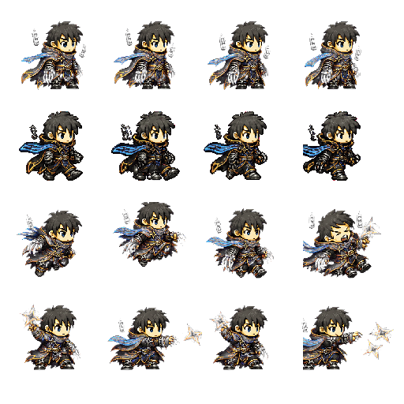

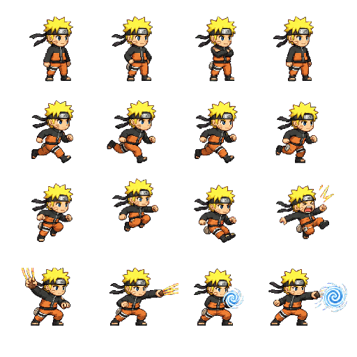

초보자 v4 시트는 낡고 덧댄 갈색 귀덮개 두건, 누더기 상의, 밧줄 허리띠, 팔다리 붕대와
닳은 샌들로 아직 장비가 없는 초보자의 허름한 인상을 강조한다. 기존 4×4 동작 순서와
프레임별 광학 중심·발 기준선을 유지해 전직 시트와 같은 물리 계약을 사용한다.

P19의 로그·어쌔신·허밋 v3 시트는 2행을 `왼발 접지 → 무릎 회수 → 오른발 접지 →
반대 무릎 회수`로 구성한다. 네 프레임은 같은 발 기준선을 공유하고 이동 시작은 첫 회수
자세에서 시작하며, 실제 이동 속도에 따라 재생 속도가 달라진다. 현재 v4 런타임은 v3의
외형·동작·원점을 유지하고 인접 셀에서 넘어온 분리 픽셀만 제거한 결정적 정리본이다.

호카게 v5 시트는 금발 가시머리·이마 보호대·볼 표식·검정/주황 복장의 독자 SD 픽셀
캐릭터다. 기존 4×4 동작 계약과
발 기준선을 유지하며, 2행의 접지·무릎 회수 보행과 4행의 근접 공격·나선환을 포함한다.
v4 생성 변환본에서 셀 경계 오염만 제거했으며 외형 픽셀은 재색상하지 않았다.

### Hokage Team Allies

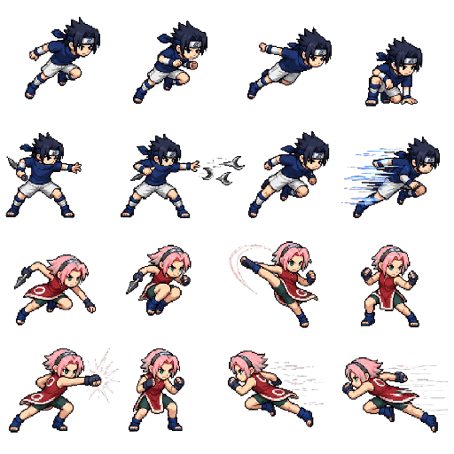

협공 동료 시온·하나는 4×4 안에서 진입, 표창 2타, 발차기 1타, 주먹 2타, 교차 퇴장을
담는다. v2에서 시온 역할은 검푸른 가시머리와 남색 상의, 하나 역할은 분홍 단발과 붉은
민소매 상의의 서로 다른 독자 SD 픽셀 캐릭터로 제작했다. 두 객체는
물리 바디 없이 시네마틱 screen-space 객체로만 생성된다.

### Green Mushroom

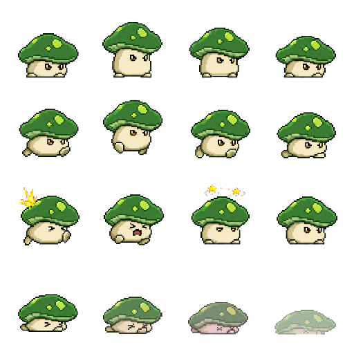

### Shadow Trial Monsters

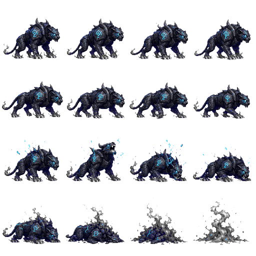

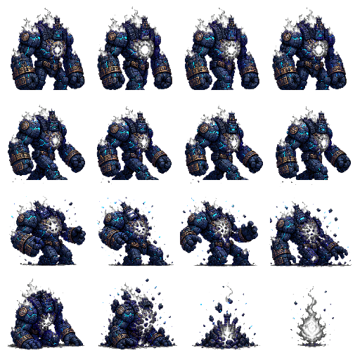

심연의 골렘 v3는 v2의 외형·원점·애니메이션을 유지하면서 보행↔피격 행과 피격 프레임 사이에
남아 있던 셀 간 연결 컴포넌트 24픽셀만 추가 제거한 배포본이다.

### Dungeon Bosses

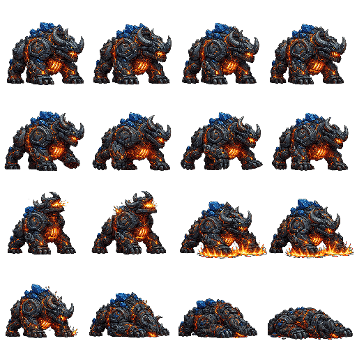

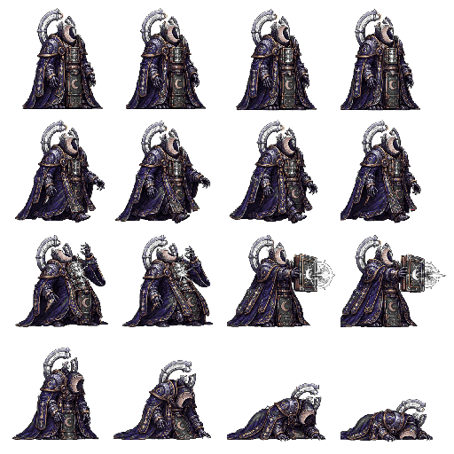

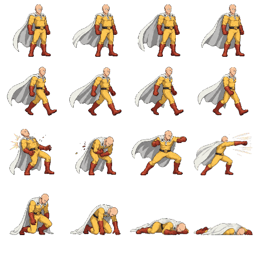

폭열군주 이그니카르·월식현자 루나시온·원펀맨은 3행의 앞 2프레임을 피격, 뒤 2프레임을
접촉·원거리 선딜 공격에 사용하고 4행은 사망 연출이다. 원펀맨은 셀별로 다시 패킹해 망토와
펀치 효과를 128×128 경계 안에 유지하며 런타임에서 2.45배로 확대한다. 보스별 HP·등급·
즉사·보상은 카탈로그와 보스 원거리 규칙에 분리한다.

### Equipped Throwing Stars

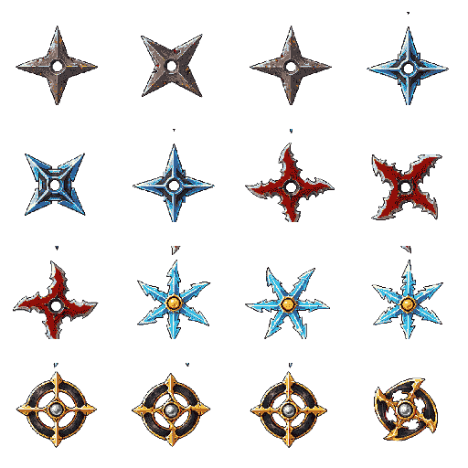

P13 런타임 표창 시트는 수련생·강철·청옥·홍염·일식의 다섯 실루엣을 담는다. 1~4등급은
각 3프레임, 5등급은 4프레임으로 회전하며, 모든 프레임은 같은 광학 중심을 사용한다. P35
보상 전용 6등급 `초대형 고드름`은 새 래스터 없이 3등급 빙결 프레임 `[6,7,8]`을 1.75배로
재사용한다. 기본·
럭키세븐·드레인·어벤저는 장착 등급의 애니메이션을 공유하고 공격별 크기·잔상·타격색은
런타임에서 더한다.

### Shadow Mentor

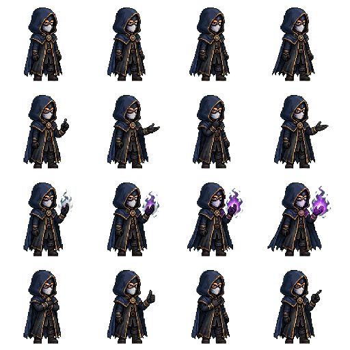

### Street Healer

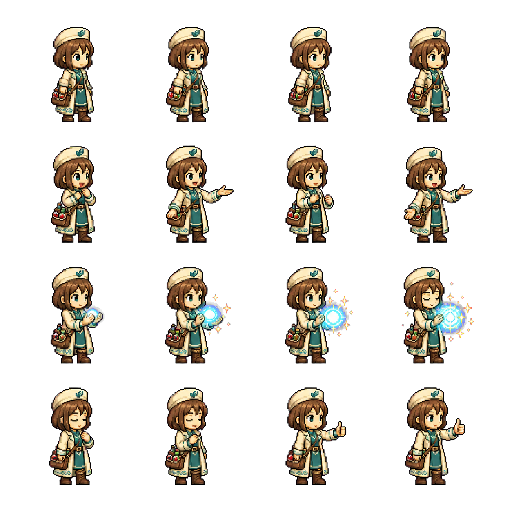

### Dungeon Scout

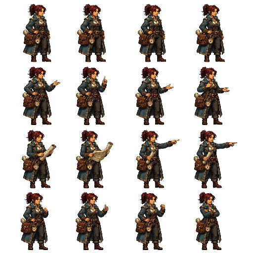

원정대장 세라는 idle·talk·brief·approve 네 행으로 의뢰 대기, 대화, 수락, 완료 보고를
구분한다. 가장 가까운 NPC 상호작용 규칙과 접근 가능한 퀘스트 DOM 대화창을 사용한다.

### Game Developer

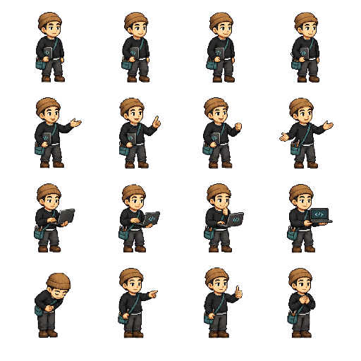

`일용직 개발자 임상진`은 idle·talk·code·thanks 네 행으로 대기, 채널 안내, 개발 작업,
구독 링크 선택 뒤 감사를 구분한다. 채널명·소개·`구독하기` 문구는 스프라이트에 넣지 않고
접근 가능한 DOM 대화창과 실제 외부 링크로 분리한다.

### Combat Effects

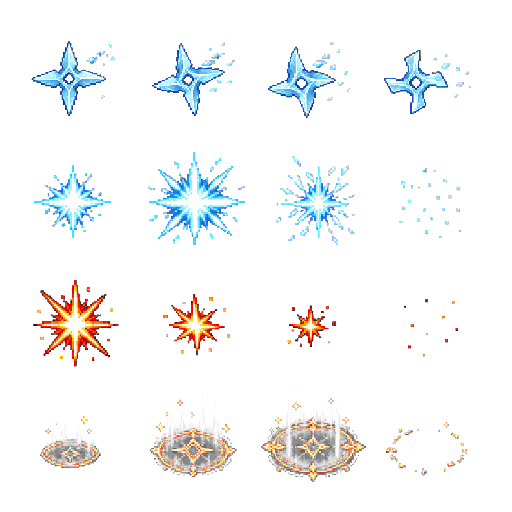

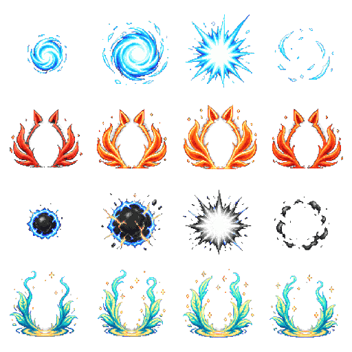

호카게 효과 시트의 1~4행은 각각 나선환, 구미호 변신 토글 오라, 미수옥,
선인모드 상시 오라다. 변신·선인모드 행은 플레이어를 합성할 수 있도록 중앙을 비우고
루프 가능한 네 프레임으로 구성한다.

### World Effects and Loot

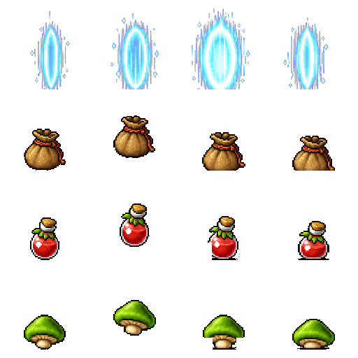

드롭 12개 셀은 `scripts/clean-loot-sprites.mjs`로 원본 v1의 이웃 행 픽셀과 착지
잔상을 제거하고, 수평 중심·공통 바닥 기준선에 맞춘 v2로 결정적으로 재생성한다.

## 런타임 규칙

- 시트 경로는 `sprite-manifest.json`을 기준으로 이 디렉터리에서 상대 해석한다.
- 왼쪽 방향은 별도 프레임을 만들지 않고 오른쪽 원본에 `flipX`를 적용한다.
- nearest-neighbor 보간을 사용한다.
- 프레임 자동 trim과 회전을 사용하지 않는다.
- 런타임 시트는 16개 모든 프레임의 `frameOrigins`를 정의한다. 캐릭터·몬스터·NPC는
  발/바닥, 효과는 광학 중심, 포탈·드롭은 수평 중심을 기준으로 흔들림을 보정한다.
- `throwingStars` 매니페스트 키는 `equipped-throwing-stars-v1.webp`를 가리키며 장착 등급과 같은
  `tier1`~`tier5` 애니메이션 이름을 사용한다.
- `hokageAllies`는 `shionEnter/Throw/Exit`, `hanaEnter/Kick/Punch/Exit` one-shot 애니메이션을
  사용하고 시네마틱 종료·맵 전환에서 모든 트윈과 함께 파괴한다.
- 프레임 원점이 바뀌어도 플레이어·몬스터·표창·드롭의 물리 바디는
  `src/game/entities/sprite-layout.ts`의 공통 offset 계산으로 월드 좌표에 고정한다.
- 새 버전을 만들 때 이전 버전 파일을 덮어쓰지 않는다.
- 인접 셀 오염 정리본은 `scripts/clean-player-frame-boundaries.mjs`로 재생성하고 원본 대비
  픽셀 추가·재색상 0건을 검증한다.
- 정규화 PNG는 생성·정렬·픽셀 감사를 위한 기준으로 보존한다. `npm run assets:webp`는
  매니페스트가 가리키는 24종의 무손실 WebP를 만들며 런타임과 `dist/`에는 WebP만 사용한다.
- 로그·어쌔신·그림자 파수꾼의 기준 PNG는 원본 RGBA를 256색으로 최적화했으며, 크로마 생성
  원본은 `source/`에 그대로 보존한다.
