# UI Assets

PC 웹 1280×720 화면에 사용하는 로그인·캐릭터 선택 배경, 공통 패널·폰트와 전투 UI 아틀라스다.

출처·생성 과정과 배포 조건은 [`ASSET_CREDITS.md`](../../ASSET_CREDITS.md)를 따른다.

## 구조

- `source/`: built-in imagegen 생성 원본
- `screens/`: 1280×720으로 중앙 크롭·정규화한 런타임 WebP
- `cinematics/`: 640×360 셀 4개를 2×2로 묶은 호카게 전체화면 연출 WebP
- `combat/`: 데미지 숫자처럼 고정 프레임이 필요한 전투 UI 아틀라스와 규격 문서
- `skills/`: 액티브·패시브 스킬별 128×128 기준 PNG와 무손실 런타임 WebP
- `panels/`: 96×96, 16px 고정 슬라이스의 책·나무·금속 SVG 패널과 imagegen 플레이 HUD WebP
- `fonts/`: 번들 한글 픽셀 폰트 WOFF2와 원본 라이선스

## 런타임 파일

- `screens/login-background-v1.webp`
- `screens/character-select-background-v1.webp`
- `combat/damage-numbers-v1.svg`
- `cinematics/hokage-cinematics-v1.webp`
- `skills/skill-lucky-seven-v1.webp`
- `skills/skill-shadow-volley-v1.webp`
- `skills/skill-keen-sight-v1.webp`
- `skills/skill-drain-v1.webp`
- `skills/skill-phantom-stars-v1.webp`
- `skills/skill-critical-throw-v1.webp`
- `skills/skill-avenger-v1.webp`
- `skills/skill-abyss-rain-v1.webp`
- `skills/skill-shadow-breathing-v1.webp`
- `skills/skill-rasengan-v1.webp`
- `skills/skill-nine-tails-transformation-v1.webp`
- `skills/skill-tailed-beast-bomb-v1.webp`
- `skills/skill-team-assault-v1.webp`
- `skills/skill-thunder-orb-v1.webp`
- `skills/skill-sage-mode-v1.webp`
- `panels/book-panel-v1.svg`
- `panels/wood-panel-v1.svg`
- `panels/metal-panel-v1.svg`
- `panels/hud-metal-panel-v1.webp`
- `panels/hud-metal-surface-v1.webp`
- `fonts/Galmuri11-v2.40.3.woff2`
- `fonts/Galmuri11-Bold-v2.40.3.woff2`

배경과 패널에는 텍스트와 조작 요소를 넣지 않는다. 입력창, 버튼, 캐릭터 정보,
NPC 대화·전직 확인은 접근 가능한 HTML과 CSS로 배치한다. DOM용 책·나무·금속 패널은
`scripts/generate-ui-panels.mjs`가 만드는 결정적 픽셀 SVG다. 플레이 HUD는 built-in
imagegen 원본 `source/hud-metal-panel-v1-source.png`에서 정규화한 프레임과 내부 표면
WebP를 Phaser `NineSlice`·Image로 사용한다. 데미지 숫자
아틀라스의 32×32 셀과 팔레트 규격은 [`combat/README.md`](./combat/README.md)를 따른다.
SVG 중앙은 단색으로 유지하고 DOM 내부는 불투명 테마 배경과 고정 inset bevel로
채운다. 가장자리는 반복 확장해 패널 우·하단과 비정수 길이에서도 빈 영역이나
비대칭 확대가 생기지 않게 한다.

Galmuri11 v2.40.3은 Lee Minseo가 제작했으며 SIL Open Font License 1.1로
게임·웹 폰트에 임베드할 수 있다. 라이선스 전문은
[`fonts/Galmuri-LICENSE.txt`](./fonts/Galmuri-LICENSE.txt)에 보존한다.

## 미리보기

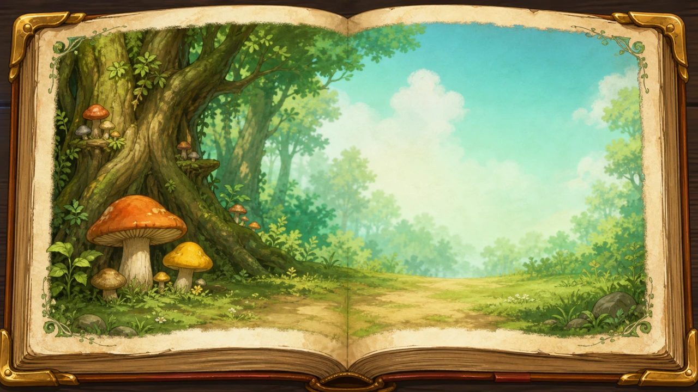

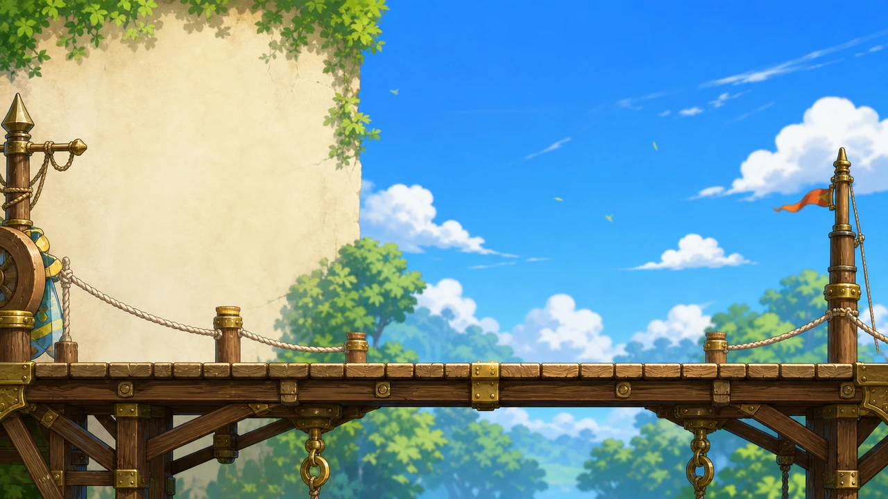

### Gameplay HUD Chrome

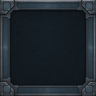
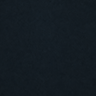

두 파일은 미니맵·퀘스트·조작·보스·하단 상태·액션 슬롯·시스템 안내·플레이 사운드 설정의 공통 배경이다.
실제 제목, 수치, 단축키와 아이콘은 런타임에서 별도로 배치한다.

### Skill Icons

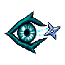
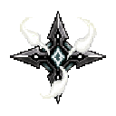

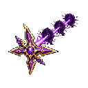
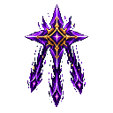
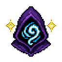

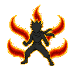
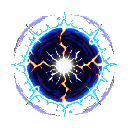

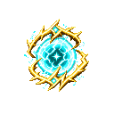

기준 PNG를 수정한 뒤 `npm run assets:webp`를 실행하면 15종 런타임 WebP가 픽셀 손실 없이
재생성된다. Vite URL과 스킬 창의 실제 ``는 WebP만 참조한다.

### Hokage Cinematics

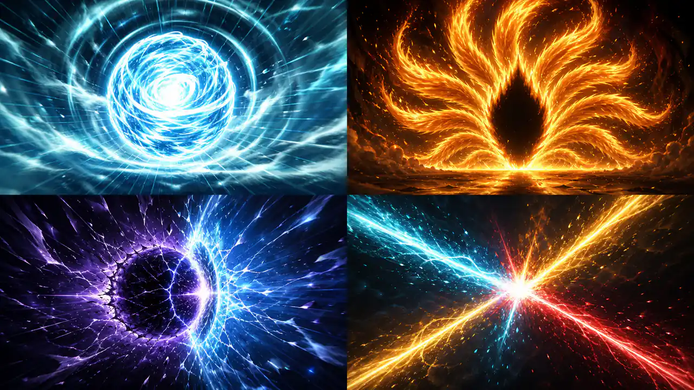

2×2 셀은 나선환, 구미호 활성화, 미수옥, 삼인 협공 순서다. 배경에는 텍스트·인물·UI를
굽지 않고 런타임에서 제목, 비네트, 스캔라인, 줌, 플래시와 카메라 진동을 합성한다.
